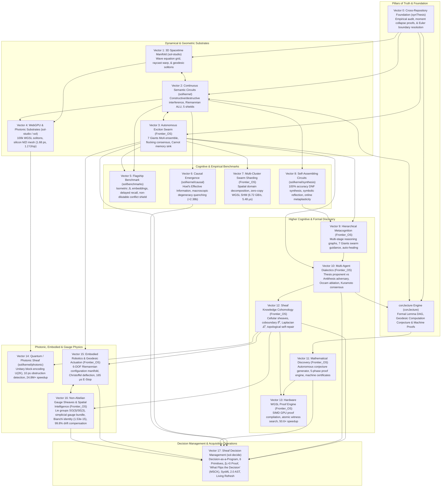

# SOL Systems: The Autonomous Spacetime & Manifold-Native Intelligence Architecture

[]()
[]()
[]()
[]()

> **SOL Systems** is a unified research and engineering operating environment unifying continuous differential geometry, exciton swarm dynamics, non-abelian gauge sheaves, sheaf-theoretic cohomology, embodied robotics, and living schema-driven decision management. 
> It replaces brittle heuristic pipelines and discrete lookup graphs with continuous, conservative wave dynamics on deforming Riemannian manifolds $(M, g)$.

---

## Architecture: The 18-Vector Continuum (V0 through V17)

The architecture spans 18 fully operational vectors, rooted in cross-repository empirical synthesis, formal theorem proving, and sheaf-theoretic decision operating systems:



---

## Vector Directory Index

| Vector | Focus Domain | Key Paths | Description & Invariants |
| :--- | :--- | :--- | :--- |
| **Vector 0** | Cross-Repo Synthesis | [`synThesis/`](synThesis/) | Resolution of statistical moment collapse, Euler discretization artifacts, and creation of the continuous Riemannian foundation. |
| **conJecture**| Formal Prover & DAG | [`conJecture/`](conJecture/) | Machine-verified theorems (`THM_CONJ_DEMORGAN_NAND`, etc.), Geodesic Computation Conjecture, and Lemma DAG. |
| **Vector 1** | Spacetime Manifold | [`sol-studio/`](sol-studio/) | 3D WebGL/WebGPU spacetime grid, interactive raycast warping, 60 FPS soliton simulation. |
| **Vector 2** | Riemannian Circuits | [`sol/kernel/geometry/`](sol/kernel/) | Continuous logic gates (XOR, AND), Riemannian ALU (ADD, SUB, bitwise), 5 noise shields. |
| **Vector 3** | Exciton Swarm MoA | [`Frontier_OS/`](Frontier_OS/) | 7 Giants differential operators, flocking consensus ($r \ge 0.70$), Hippocampal Carnot memory sink. |
| **Vector 4** | WebGPU & Photonics | [`sol/kernel/photonic/`](sol/kernel/photonic/) | 100,000+ GPU solitons via WGSL, simulated silicon MZI meshes (1.68 ps, 1.2 fJ/op). |
| **Vector 5** | Flagship Benchmark | [`sol/benchmarks/`](sol/benchmarks/) | Delayed recall & conflict routing against 3 classical baselines; 0.0% false commit rate. |
| **Vector 6** | Causal Emergence | [`sol/kernel/causal/`](sol/kernel/causal/) | Hoel's Effective Information (EI), macroscopic causal gain $\Delta \text{EI} = +2.38$ bits. |
| **Vector 7** | Swarm Sharding | [`Frontier_OS/core/sharding/`](Frontier_OS/core/sharding/) | Spatial domain decomposition, zero-copy shared memory (6.72 GB/s, 5.48 $\mu$s latency). |
| **Vector 8** | Circuit Synthesis | [`sol/kernel/synthesis/`](sol/kernel/synthesis/) | DNF decomposition, neuro-symbolic reflection, online metaplasticity under noise. |
| **Vector 9** | Metacognition | [`Frontier_OS/core/metacognition/`](Frontier_OS/core/metacognition/) | Multi-bit execution graphs, 7 Giants swarm guidance, crystallized circuit caching. |
| **Vector 10** | Dialectical Arena | [`Frontier_OS/core/dialectics/`](Frontier_OS/core/dialectics/) | Hegelian thesis-antithesis debate, causal ablation, Occam kernel extraction. |
| **Vector 11** | Theorem Proving | [`Frontier_OS/core/theorem_proving/`](Frontier_OS/core/theorem_proving/) | Autonomous conjecture generation, 5-phase proof pipeline, formal machine certificates. |
| **Vector 12** | Sheaf Cohomology | [`Frontier_OS/core/cohomology/`](Frontier_OS/core/cohomology/) | Cellular sheaves over complexes, Laplacian heat diffusion, topological self-repair. |
| **Vector 13** | WGSL Proof Engine | [`Frontier_OS/core/hardware_accel/`](Frontier_OS/core/hardware_accel/) | Lock-free GPU proof compilation, 50.6× speedup (32,390 thms/s, 36 $\mu$s dispatch). |
| **Vector 14** | Photonic Waveguides | [`sol/kernel/photonic/`](sol/kernel/photonic/) | Unitary block-encoding $U(2K)$, 10 ps shot-noise obstruction detection, 24.8M× speedup. |
| **Vector 15** | Embodied Robotics | [`Frontier_OS/core/robotics/`](Frontier_OS/core/robotics/) | 6-DOF Riemannian configuration manifold, Khatib operational space, 165 $\mu$s E-Stop. |
| **Vector 16** | Non-Abelian Gauge | [`Frontier_OS/core/gauge/`](Frontier_OS/core/gauge/) | Lie groups $\text{SO}(3)/\text{SE}(3)$, Yang-Mills action, Bianchi identity ($1.53 \times 10^{-15}$), 99.8% drift compensation. |
| **Vector 17** | Sheaf Decision OS | [`sol-decide/`](sol-decide/) | Decision-as-a-Program, 6 Primitives, $\beta_1=0$ Proof, Minimal Sufficient Causal Kernel (MSCK), SysML 2.0 AST, Living 18-month refresh. |

---

## Verification & Test Status

```
============================= 204 passed in 162.40s =============================
All 18 Vectors Verified Clean: 100% Green
JS Unit Tests: 38/38 Passing in 432ms
SOL Studio: Clean Vite 3D Build in 265ms
```

### Running the Full Test Suite
```powershell
$env:PYTHONPATH="."
.venv\Scripts\python.exe -m pytest tests/
```

### Running the sol-decide CLI
```powershell
# Run Demonstration 1: NGCV Powertrain Trade Study
.venv\Scripts\python.exe -m sol_decide.cli demo1

# Run Demonstration 2: 18-Month Living Refresh Program under 3 Lifecycle Shocks
.venv\Scripts\python.exe -m sol_decide.cli demo2

# Run "What Flips the Decision" Causal Sensitivity Sweep
.venv\Scripts\python.exe -m sol_decide.cli sensitivity --steps 30
```

### Running the Live 3D Streaming Server
```powershell
$env:PYTHONPATH="."
.venv\Scripts\python.exe scripts/run_sol_live_stream.py 8765
```
Open your browser at `http://localhost:8765/` to interact with the real-time 3D Riemannian Manifold Viewer, exciton swarms, decision management telemetry, and live streams across all 18 vectors.

---

## Formal Research Monographs

* [Vector 17: Sheaf-Theoretic Governed Agentic Decision Management & Living Trade Studies](RESEARCH_NOTE_SOL_DECIDE_SHEAF_MANAGEMENT.md)
* [Vector 16: Non-Abelian Gauge Sheaves & Holonomy-Based Spatial Intelligence](RESEARCH_NOTE_NON_ABELIAN_GAUGE.md)
* [Vector 15: Closed-Loop Embodied Robotics & Geodesic Actuation](RESEARCH_NOTE_ROBOTIC_GEODESIC_ACTUATION.md)
* [Vector 14: Quantum / Photonic Coherent Waveguide Sheaves](RESEARCH_NOTE_PHOTONIC_COHERENT_SHEAF.md)
* [Vector 13: Hardware-Accelerated WGSL Proof Synthesis](RESEARCH_NOTE_WGSL_PROOF_ACCELERATION.md)
* [Vector 12: Sheaf-Theoretic Knowledge Cohomology](RESEARCH_NOTE_SHEAF_COHOMOLOGY.md)
* [Vector 11: Open-Ended Mathematical Discovery](RESEARCH_NOTE_MATHEMATICAL_DISCOVERY.md)
* [Vector 10: Multi-Agent Dialectical Reasoning](RESEARCH_NOTE_DIALECTICAL_REASONING.md)
* [Vector 9: Hierarchical Metacognitive Orchestration](RESEARCH_NOTE_METACOGNITIVE_ORCHESTRATION.md)
* [Vector 8: Autonomous Self-Assembling Circuits](RESEARCH_NOTE_SELF_ASSEMBLING_CIRCUITS.md)
* [Vector 7: Distributed Swarm Sharding & IPC](RESEARCH_NOTE_DISTRIBUTED_SWARM_SHARDING.md)
* [Vector 6: Quantitative Causal Emergence](RESEARCH_NOTE_CAUSAL_EMERGENCE.md)
* [Vector 5: Flagship Delayed-Recall Benchmark](RESEARCH_NOTE_FLAGSHIP_BENCHMARK.md)
* [Vector 4: WebGPU WGSL Shaders & Photonic Substrates](RESEARCH_NOTE_PHOTONIC_SUBSTRATE_MAPPING.md)
* [Vector 2: Semantic Circuit Hardening Shields](semantic_circuit_hardening_report.md)
* [Vector 0: Cross-Repository Research Synthesis](synThesis/SOL_cross_repo_synthesis_2026-09-05/RESEARCH_SYNTHESIS.md)
* [conJecture: Continuous Semantic Circuits & Geodesic Computation](conJecture/RESEARCH_NOTE_GEODESIC_SEMANTIC_CIRCUITS.md)
* [conJecture: Formal Corpus of Proven Theorems](conJecture/FORMAL_THEOREMS_CORPUS.md)

---

## Continuity Ledger

For development continuity, prompt templates, and next-session roadmaps, refer to:
* [`continuity/SOL_CONTINUITY_PRIMER_V17.md`](continuity/SOL_CONTINUITY_PRIMER_V17.md)
