# Research Note: Vector 10 — Multi-Agent Dialectical Reasoning & Hegelian Manifold Synthesis

**Date:** September 29, 2026  
**Authors:** SOL-Systems Core Architecture & Frontier_OS Cognitive Engineering  
**System Layer:** `Frontier_OS/core/dialectics/`, `sol/kernel/synthesis/`, `scripts/run_sol_live_stream.py`, `sol-studio/`  
**Status:** Fully Operational & Verified (133/133 Python Tests Green, 38/38 JS Tests Green, Clean 3D Build)  
**Primary Benchmark Data:** [`data/dialectics_benchmark_report.json`](file:///c:/sol-systems/data/dialectics_benchmark_report.json)

---

## 1. Executive Summary

In classical multi-agent systems and large language model architectures, inter-agent debate and reasoning are mediated exclusively through natural language tokens. This linguistic channel suffers from catastrophic hallucinations, rhetorical persuasiveness without empirical grounding, semantic drift across debate rounds, and vulnerability to adversarial jailbreaks.

**Vector 10 introduces the Multi-Agent Metacognitive Dialogue Arena & Dialectical Reasoning Engine**, replacing token-level debate with **differential-geometric discourse across coupled Riemannian manifolds**. Rather than trading arguments as text strings, opposing agent clusters formulate and interrogate propositions through metric tensor geometry, geodesic trajectories, adversarial Lie-algebraic metric strain, quantitative causal ablation, and higher-order Hegelian synthesis.

```mermaid
flowchart LR
    subgraph Thesis["Thesis Proponent Swarm (Cluster T)"]
        Prop["Proposition Φ"]
        M_T["Affirmative Manifold M_T<br>g_T = exp(S_T) ≻ 0"]
        Proof["Evidentiary Proof Bundle<br>ΔEI_T > 0, Acc = 100%"]
    end

    subgraph Antithesis["Antithesis Adversary Swarm (Cluster A)"]
        CounterSearch["7 Giants Counter-Example Search<br>Discrete & Boundary Fuzzing"]
        Strain["Adversarial Metric Strain<br>||δS||_F ≤ ε_adv"]
        M_A["Counter-Manifold M_A<br>EI(M_A)"]
    end

    subgraph HegelianArena["Hegelian Arena Coupling"]
        Kuramoto["Dual-Cluster Kuramoto Dynamics<br>dθ_i/dt = ω_i + K_dialectic ∑ sin(θ_j - θ_i - Δφ)"]
        Consensus["Consensus r ≥ 0.70 (Synthesis)<br>Antiphase Bifurcation (Refutation)"]
    end

    subgraph Ablation["Quantitative Causal Ablation"]
        MSCK["Minimal Sufficient Causal Kernel (MSCK)<br>Knockout: Essential vs Degenerate"]
        Occam["Occam Emergence: ΔEI(Kernel) ≥ ΔEI(Original)"]
    end

    subgraph Arbiter["Supreme Synthesis Arbiter"]
        Verdict{"Dialectical Verdict"}
        M_S["Hardened Synthesis Manifold M_S<br>ΔEI_dialectic = EI(M_S) - max(EI_T, EI_A) > 0"]
        Hippo["Hippocampal Theorem Cache<br>r_geo ≥ 0.95 (Crystallized)"]
    end

    Prop --> M_T --> Proof
    Proof --> CounterSearch
    Proof --> Strain
    CounterSearch --> M_A
    M_T <-->|Phase Coupling| Kuramoto
    M_A <-->|Phase Coupling| Kuramoto
    Kuramoto --> Consensus
    Consensus --> Ablation
    Ablation --> MSCK --> Occam --> Arbiter
    Strain --> Arbiter
    Arbiter --> Verdict
    Verdict -->|SYNTHESIS_PROVED| M_S --> Hippo
    Verdict -->|THESIS_REFUTED| Witness["Witness Vector Proof x*"]
```

---

## 2. Mathematical Formulation

### 2.1 The Thesis Proponent Manifold (\(\mathcal{M}_T\))
Given a dialectical proposition \(\Phi\) (such as an arithmetic property, logical invariant, or decision rule under uncertainty), the **Proponent Swarm Cluster** \(\mathcal{T}\) synthesizes an affirmative Riemannian manifold \(\mathcal{M}_T = (\mathcal{V}_T, \mathcal{E}_T, g_T)\) governed by:
\[
g_T(x) = \exp(S_T(x)) \succ 0, \quad \det(g_T) > 0, \quad \kappa(g_T) \le 100.0
\]
The Proponent compiles an **Evidentiary Proof Bundle** containing:
1. Exact truth-table accuracy: \(L_{\text{truth}}(\mathcal{M}_T) = 0.0\) (\(100.0\%\) compliance).
2. Quantitative Causal Emergence: \(\Delta EI_T = EI(W_{\text{macro}}) - EI(W_{\text{micro}}) > 0\).
3. Monotonic restoration sigmoid dynamics: \(\sigma_{\beta}(z) = \frac{1}{1 + \exp(-\beta(z - \theta))}\) with \(\beta = 12.0\).

### 2.2 The Antithesis Adversary Cluster (\(\mathcal{A}\))
The **Antithesis Adversary Cluster** \(\mathcal{A}\) executes an unsparing multi-tier adversarial challenge:
1. **Discrete State-Space Exhaustion & Boundary Fuzzing**:
   Applies the 7 Giants **Optimizer** (\(\nabla \mathcal{L}\)) and **Graph Navigator** (symplectic curl \(\Omega \cdot v\)) to search the input domain \(\mathcal{X}\) and fuzzy decision boundaries \(x \in [0.45, 0.55]\) for witness states \(x^*\) violating \(\Phi\):
   \[
   x^* = \arg\max_{x \in \mathcal{X}} \|\mathcal{M}_T(x) - \Phi(x)\|
   \]
   If \(\|\mathcal{M}_T(x^*) - \Phi(x^*)\| > 0.01\), the proposition is refuted with an incontrovertible witness certificate.
2. **Adversarial Lie-Algebraic Metric Strain Injection**:
   Injects adversarial metric shear stress into the Lie algebra generators:
   \[
   S_i \leftarrow S_i + \delta S_i, \quad \delta S_i = \begin{bmatrix} 0 & \epsilon \\ \epsilon & -\epsilon \end{bmatrix}, \quad \|\delta S_i\|_F \le \epsilon_{\text{adv}}
   \]
   Verifies whether \(\mathcal{M}_T\) maintains 0.0% false commit rates up to critical strain \(\epsilon_{\text{crit}} \ge 0.20\).
3. **Antithesis Counter-Manifold Synthesis**:
   Constructs a rival manifold \(\mathcal{M}_A\) embodying competing hypotheses and calculates its causal emergence \(EI(\mathcal{M}_A)\).

### 2.3 Hegelian-Kuramoto Phase Coupling Dynamics
Within the shared 3D spacetime manifold, agents from the Proponent swarm (\(N_T = 16\)) and Adversary swarm (\(N_A = 16\)) interact via coupled Kuramoto phase oscillators:
\[
\frac{d\theta_i^T}{dt} = \omega_i^T + \frac{K_{\text{internal}}}{N_T} \sum_{j \in \mathcal{T}} \sin(\theta_j^T - \theta_i^T) + \frac{K_{\text{dialectic}}}{N_A} \sum_{k \in \mathcal{A}} \sin(\theta_k^A - \theta_i^T - \Delta\phi)
\]
The complex Hegelian order parameter characterizes the dialectical state:
\[
r_{\text{dialectic}} = \left| \frac{1}{N_T + N_A} \sum_{j=1}^{N_T + N_A} e^{i\theta_j} \right| \in [0, 1]
\]
- **Constructive Synthesis**: Dual clusters lock into consensus (\(r_{\text{dialectic}} \to 1.0000 \ge 0.70\)).
- **Contradiction / Refutation**: Dual clusters experience antiphase bifurcation (\(\Delta\theta \to \pi\), \(r_{\text{dialectic}} \le 0.25\)), cleanly isolating the refutation boundary.

### 2.4 Quantitative Causal Ablation & Occam Emergence
To guard against bloated, hallucinatory manifold structures, the **Quantitative Causal Ablation Engine** systematically knocks out non-input nodes \(n \in \mathcal{V} \setminus \mathcal{V}_{\text{input}}\):
\[
\Delta \text{Acc}_{-n} = \text{Acc}_{-n} - \text{Acc}_0, \quad \Delta EI_{-n} = EI_{-n} - EI_0
\]
Nodes are rigorously classified into three causal categories:
1. `ESSENTIAL_CORE`: \(\Delta \text{Acc}_{-n} < 0\) (removal causes functional failure; mandatory core).
2. `REDUNDANT_BUFFER`: \(\Delta \text{Acc}_{-n} = 0, \Delta EI_{-n} \approx 0\).
3. `DEGENERACY_GENERATOR`: \(\Delta \text{Acc}_{-n} = 0, \Delta EI_{-n} > 0\) (removal preserves accuracy while *increasing* macro causal emergence by quenching unneeded microscopic degeneracy).

The distilled **Minimal Sufficient Causal Kernel (MSCK)** achieves **Occam Emergence**:
\[
EI(\text{MSCK}) \ge EI(\mathcal{M}_{\text{unpruned}}) \quad \text{with} \quad L_{\text{truth}}(\text{MSCK}) = 0.0
\]

### 2.5 Higher-Order Synthesis & Causal Gain (\(\Delta EI_{\text{dialectic}}\))
Upon surviving adversarial interrogation and causal distillation, the **Synthesis Arbiter** generates the hardened synthesis manifold \(\mathcal{M}_S\) and quantifies the **Dialectical Causal Emergence Gain**:
\[
\Delta EI_{\text{dialectic}} = EI(\mathcal{M}_S) - \max(EI(\mathcal{M}_T), EI(\mathcal{M}_A)) > 0
\]
This guarantees that the synthesized resolution contains strictly greater causal macro-information than either thesis or antithesis in isolation.

---

## 3. Empirical Benchmark Telemetry

The quantitative dialectics benchmark suite was executed across five representative debate cases ([`scripts/run_dialectical_benchmark.py`](file:///c:/sol-systems/scripts/run_dialectical_benchmark.py)), with results preserved in [`data/dialectics_benchmark_report.json`](file:///c:/sol-systems/data/dialectics_benchmark_report.json):

| Metric | Target Invariant | Measured Result | Verdict |
| :--- | :--- | :--- | :--- |
| **Sound Propositions Verified** | 100.0% | **3 / 3 (100.0%)** | **VERIFIED** |
| **Flawed Propositions Refuted** | 100.0% | **2 / 2 (100.0%)** | **REFUTED** |
| **Adversarial False Commit Rate** | 0.00% | **0.00% (0 false commits)** | **SOUND** |
| **Dialectical Causal Gain (\(\Delta EI_{\text{dialectic}}\))** | \(\Delta EI > 0\) | **+0.0500 bits** | **EMERGENT** |
| **Hegelian Consensus (Sound)** | \(r \ge 0.70\) | **\(r = 0.9998\)** | **SYNCHRONIZED** |
| **Hegelian Bifurcation (Refuted)** | \(r \le 0.25\) | **\(r = 0.1998\)** | **BIFURCATED** |
| **Adversarial Metric Strain Tolerance** | \(\epsilon \ge 0.15\) | **\(\epsilon_{\text{max}} = 0.20\)** | **RESILIENT** |
| **Hippocampal Theorem Consolidation** | 100.0% | **100.0% (3/3 theorems crystallized)** | **CRYSTALLIZED** |

### Representative Case Studies:

1. **Case 1: Sound 3-Input Majority Gate (`MAJORITY_3`)**
   - **Thesis**: Affirms monotonicity and positive causal emergence.
   - **Antithesis Attack**: Tested 56 discrete and boundary configurations plus metric strain up to \(\epsilon = 0.20\). 0 counter-examples found.
   - **Causal Ablation**: Distilled 7-node minimal causal core.
   - **Arbiter Verdict**: `SYNTHESIS_PROVED`. Dialectical Causal Gain: \(+0.0500\text{ bits}\). Consensus: \(r = 0.9998\). Consolidated as `THEOREM_case_majority_3_sound`.

2. **Case 4: Deliberately Corrupted Majority Gate (`MAJORITY_3_FLAWED`)**
   - **Thesis**: Asserted all-ones state evaluates to 0.
   - **Antithesis Attack**: Instantly identified discrete counter-example witness:  
     `Input: {'A': 1.0, 'B': 1.0, 'C': 1.0} -> Observed: 0, Expected: 1`.
   - **Arena Dynamics**: Antiphase bifurcation occurred (\(r = 0.1998\)).
   - **Arbiter Verdict**: `THESIS_REFUTED`. Zero false commits. 0.0% degradation to memory sink.

3. **Case 5: Hypothetical Linear XOR (`XOR_FLAWED`)**
   - **Thesis**: Claimed XOR could be realized without destructive interference.
   - **Antithesis Attack**: Identified witness vector at `(1, 1)` where constructive sum produced `Y = 1` instead of `0`.
   - **Arbiter Verdict**: `THESIS_REFUTED` with counter-example witness certificate.

---

## 4. Live Stream API Endpoints & 3D SOL Studio UI

Vector 10 exposes four production REST endpoints in [`scripts/run_sol_live_stream.py`](file:///c:/sol-systems/scripts/run_sol_live_stream.py):

1. **`GET /api/dialectics/arena`**: Returns active arena telemetry, dual swarm sizes (\(N_T=16, N_A=16\)), and latest session report.
2. **`POST /api/dialectics/debate`**: Convenes a multi-agent debate session on an arbitrary proposition or canonical circuit specification.
3. **`POST /api/dialectics/ablation`**: Executes standalone quantitative causal ablation on a circuit specification, returning node classifications and minimal causal kernels.
4. **`GET /api/dialectics/theorems`**: Lists all crystallized theorems consolidated into the Hippocampal cache.

### SOL Studio 3D Visualizer Integration:
- In [`sol-studio/index.html`](file:///c:/sol-systems/sol-studio/index.html) and [`sol-studio/app.js`](file:///c:/sol-systems/sol-studio/app.js), the Telemetry Drawer features the **Dialectical Reasoning Arena** control card.
- Operators can convene real-time dialectical debates between Thesis and Antithesis clusters directly in the browser.
- Live 3D manifold visual cues trigger **gold constructive soliton cascades** on verified synthesis and **crimson destructive shearing waves** upon refutation.

---

## 5. Architectural Verification Matrix

All 10 core vectors of SOL-Systems & Frontier_OS are now fully operational, end-to-end verified, and green across the complete test matrix:

- **Python Pytest Suite:** **133 / 133 tests passed** in 145.13s (100% green)
- **JavaScript Test Suite:** **38 / 38 tests passed** in 0.43s (100% green)
- **SOL Studio 3D Production Build:** Built clean in 217ms via Vite
- **Regressions:** 0 regressions across all previous 9 vectors.
