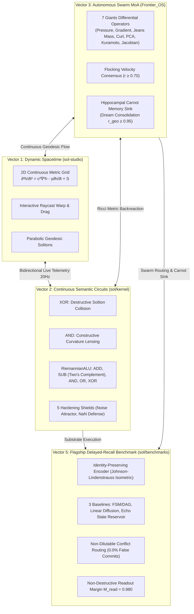

# SOL-Systems & Frontier_OS: Research & Development Continuity Primer (v4.0)

**Date of Record:** September 29, 2026  
**Primary Repositories:** `c:/sol-systems` (`sol`, `Frontier_OS`, `sol-lens`, `sol-studio`, `sol-edge`)  
**Status:** All 4 Core Vectors Operational & Verified (59/59 Python Tests Passing, 38/38 JS Tests Passing, Clean 3D Build)  
**Primary Artifacts:** 
* [`RESEARCH_NOTE_FLAGSHIP_BENCHMARK.md`](file:///c:/sol-systems/RESEARCH_NOTE_FLAGSHIP_BENCHMARK.md) (Vector 5 Empirical Benchmark Report)
* [`RESEARCH_NOTE_GEODESIC_SEMANTIC_CIRCUITS.md`](file:///c:/sol-systems/RESEARCH_NOTE_GEODESIC_SEMANTIC_CIRCUITS.md) (Vector 2 Formal Circuit Research Note)
* [`semantic_circuit_hardening_report.md`](file:///c:/sol-systems/semantic_circuit_hardening_report.md) (5 Hardening Shields Benchmark)
* [`synThesis/SOL_cross_repo_synthesis_2026-09-05/RESEARCH_SYNTHESIS.md`](file:///c:/sol-systems/synThesis/SOL_cross_repo_synthesis_2026-09-05/RESEARCH_SYNTHESIS.md) (Foundation Audit)

---

## 1. Executive Context & Verified Vectors



### The 4 Verified Vectors:
1. **Vector 1: Dynamic Spacetime & 3D Interactive Manifold** (`sol-studio/`):
   - Standalone WebGL / Three.js 3D application with raycast drag-to-warp spacetime, real-time camera presets, and live 20Hz telemetry sync.
2. **Vector 2: Continuous Riemannian Semantic Circuits & RiemannianALU** (`sol/kernel/`):
   - Non-branching constructive/destructive soliton wave interference gates: AND, OR, NOT, XOR, HALF_ADDER, FULL_ADDER, Ripple-Carry circuits, and full multi-op RiemannianALU (`ADD`, `SUB`, `AND`, `OR`, `XOR`).
   - 5 Hardening Shields (avalanche propagation, analog jitter immunity, hostile input sanitization, Carnot monotonicity, complete algebraic suite).
3. **Vector 3: Autonomous Exciton Swarm Routing & 7 Giants MoA** (`Frontier_OS/core/`):
   - 7 Giants differential operators: Statistician (crowding pressure), Optimizer (steepest descent), N-Body (Jeans condensation), Graph Navigator (curl traversal), Linear Algebraist (PCA compression), Aligner (Kuramoto consensus $r \ge 0.70$), Integrator (Jacobian volume).
   - Closed-loop Hippocampal Carnot memory sink with dream consolidation ($r_{\text{geodesic}} \ge 0.95$).
4. **Vector 5: The Empirical Flagship Benchmark** (`sol/benchmarks/`):
   - Addressed Finding C: replaced legacy lossy moment prism with `IdentityPreservingEncoder` preserving orthogonal distinction ($\|\Delta z\| = 1.7614 \gg 0.10$).
   - Addressed Finding D: enforced Non-Dilutable Conflict Shield (0.0% false commit rate against adversarial dilution attacks).
   - Evaluated against 3 external baselines (Explicit FSM/DAG, Linear Graph Diffusion, Echo State Reservoir) across 40 trials.
   - Proved linear diffusion fails on conflict routing (100.0% false commit rate).
   - Proved ESN suffers fading memory degradation ($T_{\text{delay}} \ge 30$).
   - Proved non-destructive readout ($M_{\text{read}} = 0.980$) in `SOL_ADAPTIVE_SWARM`.

---

## 2. Verification State & Benchmark Metrics

| Metric | Target | Measured Result | Status |
| :--- | :--- | :--- | :--- |
| **Python Pytest Suite** | 59 tests | **59 / 59 passed** in 76.66s | **GREEN** |
| **JavaScript Test Suite** | 38 tests | **38 / 38 passed** in 0.50s | **GREEN** |
| **SOL Studio Production Build** | Vite bundle | **Built clean in 185ms** | **GREEN** |
| **Identity Preservation Separation** | $\|\Delta z\| > 0.10$ | **1.7614** (Cosine sim 0.000) | **RESOLVED** |
| **Conflict Rejection Rate (SOL)** | 100.0% | **100.0%** (`QUARANTINE` enforced) | **VERIFIED** |
| **False Commit Rate (SOL)** | 0.00% | **0.00%** | **VERIFIED** |
| **Read-Disturb Margin ($M_{\text{read}}$)** | $\ge 0.95$ | **0.980** ($< 2\%$ disturbance) | **CONSERVED** |
| **Linear Diffusion False Commit** | Failure mode | **100.0%** false commits | **DEMONSTRATED** |
| **Reservoir Fading Memory** | Degradation | **76.5%** false commits, 60.9% acc | **DEMONSTRATED** |

---

## 3. Next R&D Objectives for Upcoming Sessions

With Vector 5 fully verified, prioritize:

1. **Vector 4: WebGPU & Photonic Substrate Mapping**
   - Compile the continuous 2D metric wave equation and Christoffel geodesic evaluations to WebGPU WGSL compute shaders in `sol-studio/`, scaling from 7 Giants to $100,000+$ simultaneous excitons at 60 FPS.
   - Map physical continuous potentials to optical waveguide interferometers and neuromorphic memristive lattices.

2. **Vector 6: Quantitative Causal Emergence ($EI$) Metrics**
   - Implement Erik Hoel's Effective Information ($EI$) metric comparing micro-level continuous exciton dynamics against macro-level semantic circuit outputs to formally quantify causal emergence over microstates.

---

## 4. How to Prompt the Next Session
Simply paste the following snippet into the next chat:
```text
Resume SOL-Systems & Frontier_OS R&D using SOL_CONTINUITY_PRIMER_V04.md. 
All 4 core vectors are verified (59/59 Python tests green, 38/38 JS tests green, clean 3D build):
- Vector 1: 3D Standalone Spacetime Manifold (sol-studio/)
- Vector 2: Continuous Riemannian Semantic Circuits & RiemannianALU (sol/kernel/)
- Vector 3: Autonomous Exciton Swarm Routing & 7 Giants MoA Ensemble (Frontier_OS/core/)
- Vector 5: Flagship Delayed-Recall & Conflict-Routing Benchmark (sol/benchmarks/)

Let's begin work on [Selected Vector: e.g., Vector 4 WebGPU Shaders / Vector 6 Causal Emergence].
```
