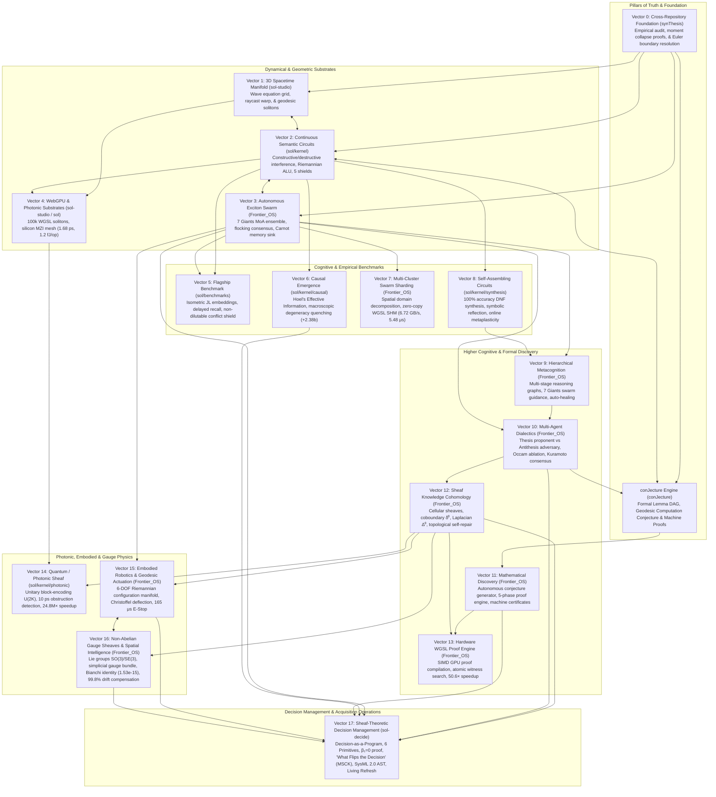

# SOL-Systems & Frontier_OS: Research & Development Continuity Primer (v17.0)

**Date of Record:** September 30, 2026  
**Primary Repositories:** `c:/sol-systems` (`synThesis`, `conJecture`, `sol`, `sol-studio`, `Frontier_OS`, `sol-lens`, `sol-edge`, `sol-decide`)  
**Status:** All 18 Vectors (Vector 0 through Vector 17) Fully Operational & Verified (204/204 Python Tests Passing, 38/38 JS Tests Passing, Clean 3D Build)  
**Primary Artifacts:** 
* [`RESEARCH_NOTE_SOL_DECIDE_SHEAF_MANAGEMENT.md`](file:///c:/sol-systems/RESEARCH_NOTE_SOL_DECIDE_SHEAF_MANAGEMENT.md) (Vector 17 Sheaf Decision Management & Living Trade Studies Note)
* [`data/sol_decide_benchmark_report.json`](file:///c:/sol-systems/data/sol_decide_benchmark_report.json) (Vector 17 Telemetry & Machine-Precision Benchmark Report)
* [`sol-decide/README.md`](file:///c:/sol-systems/sol-decide/README.md) (Vector 17 Comprehensive Subsystem Documentation & CDRL Alignment)
* [`RESEARCH_NOTE_NON_ABELIAN_GAUGE.md`](file:///c:/sol-systems/RESEARCH_NOTE_NON_ABELIAN_GAUGE.md) (Vector 16 Non-Abelian Gauge Sheaves & Holonomy Note)
* [`data/gauge_sheaf_benchmark_report.json`](file:///c:/sol-systems/data/gauge_sheaf_benchmark_report.json) (Vector 16 Telemetry & Machine-Precision Benchmark Report)
* [`RESEARCH_NOTE_ROBOTIC_GEODESIC_ACTUATION.md`](file:///c:/sol-systems/RESEARCH_NOTE_ROBOTIC_GEODESIC_ACTUATION.md) (Vector 15 Embodied Robotics & Geodesic Actuation Note)
* [`data/robotic_actuation_benchmark_report.json`](file:///c:/sol-systems/data/robotic_actuation_benchmark_report.json) (Vector 15 Robotic Telemetry & Actuation Benchmark Report)
* [`RESEARCH_NOTE_PHOTONIC_COHERENT_SHEAF.md`](file:///c:/sol-systems/RESEARCH_NOTE_PHOTONIC_COHERENT_SHEAF.md) (Vector 14 Quantum/Photonic Coherent Sheaf Note)
* [`data/photonic_sheaf_benchmark_report.json`](file:///c:/sol-systems/data/photonic_sheaf_benchmark_report.json) (Vector 14 Telemetry & Substrate Speedup Report)
* [`RESEARCH_NOTE_WGSL_PROOF_ACCELERATION.md`](file:///c:/sol-systems/RESEARCH_NOTE_WGSL_PROOF_ACCELERATION.md) (Vector 13 WGSL Proof Acceleration & Micro-Arch Note)
* [`data/wgsl_acceleration_benchmark_report.json`](file:///c:/sol-systems/data/wgsl_acceleration_benchmark_report.json) (Vector 13 Telemetry & Speedup Report)
* [`RESEARCH_NOTE_SHEAF_COHOMOLOGY.md`](file:///c:/sol-systems/RESEARCH_NOTE_SHEAF_COHOMOLOGY.md) (Vector 12 Sheaf-Theoretic Knowledge Cohomology Note)
* [`data/cohomology_benchmark_report.json`](file:///c:/sol-systems/data/cohomology_benchmark_report.json) (Vector 12 Cohomology Telemetry)
* [`RESEARCH_NOTE_MATHEMATICAL_DISCOVERY.md`](file:///c:/sol-systems/RESEARCH_NOTE_MATHEMATICAL_DISCOVERY.md) (Vector 11 Open-Ended Mathematical Discovery Note)
* [`data/discovery_benchmark_report.json`](file:///c:/sol-systems/data/discovery_benchmark_report.json) (Vector 11 Automated Theorem Prover Telemetry)
* [`RESEARCH_NOTE_DIALECTICAL_REASONING.md`](file:///c:/sol-systems/RESEARCH_NOTE_DIALECTICAL_REASONING.md) (Vector 10 Multi-Agent Dialectical Reasoning Note)
* [`data/dialectics_benchmark_report.json`](file:///c:/sol-systems/data/dialectics_benchmark_report.json) (Vector 10 Dialectics & Occam Ablation Telemetry)
* [`RESEARCH_NOTE_METACOGNITIVE_ORCHESTRATION.md`](file:///c:/sol-systems/RESEARCH_NOTE_METACOGNITIVE_ORCHESTRATION.md) (Vector 9 Hierarchical Metacognitive Orchestration Note)
* [`data/metacognition_benchmark_report.json`](file:///c:/sol-systems/data/metacognition_benchmark_report.json) (Vector 9 Multi-Stage Orchestration Telemetry)
* [`RESEARCH_NOTE_SELF_ASSEMBLING_CIRCUITS.md`](file:///c:/sol-systems/RESEARCH_NOTE_SELF_ASSEMBLING_CIRCUITS.md) (Vector 8 Autonomous Self-Assembling Circuits Note)
* [`data/circuit_synthesis_benchmark_report.json`](file:///c:/sol-systems/data/circuit_synthesis_benchmark_report.json) (Vector 8 Circuit Synthesis & Metaplasticity Telemetry)
* [`RESEARCH_NOTE_DISTRIBUTED_SWARM_SHARDING.md`](file:///c:/sol-systems/RESEARCH_NOTE_DISTRIBUTED_SWARM_SHARDING.md) (Vector 7 Distributed Swarm Sharding Note)
* [`data/distributed_sharding_benchmark_report.json`](file:///c:/sol-systems/data/distributed_sharding_benchmark_report.json) (Vector 7 Sharding & IPC Telemetry)
* [`RESEARCH_NOTE_CAUSAL_EMERGENCE.md`](file:///c:/sol-systems/RESEARCH_NOTE_CAUSAL_EMERGENCE.md) (Vector 6 Quantitative Causal Emergence Note)
* [`data/causal_emergence_benchmark_report.json`](file:///c:/sol-systems/data/causal_emergence_benchmark_report.json) (Vector 6 Causal Emergence Telemetry)
* [`RESEARCH_NOTE_PHOTONIC_SUBSTRATE_MAPPING.md`](file:///c:/sol-systems/RESEARCH_NOTE_PHOTONIC_SUBSTRATE_MAPPING.md) (Vector 4 WebGPU & Photonic Substrates)
* [`RESEARCH_NOTE_FLAGSHIP_BENCHMARK.md`](file:///c:/sol-systems/RESEARCH_NOTE_FLAGSHIP_BENCHMARK.md) (Vector 5 Empirical Benchmark Report)
* [`semantic_circuit_hardening_report.md`](file:///c:/sol-systems/semantic_circuit_hardening_report.md) (5 Hardening Shields Benchmark)
* [`synThesis/SOL_cross_repo_synthesis_2026-09-05/RESEARCH_SYNTHESIS.md`](file:///c:/sol-systems/synThesis/SOL_cross_repo_synthesis_2026-09-05/RESEARCH_SYNTHESIS.md) (Vector 0 Cross-Repository Empirical Audit & Foundation)
* [`conJecture/RESEARCH_NOTE_GEODESIC_SEMANTIC_CIRCUITS.md`](file:///c:/sol-systems/conJecture/RESEARCH_NOTE_GEODESIC_SEMANTIC_CIRCUITS.md) (Foundational Geodesic Computation Conjecture)
* [`conJecture/FORMAL_THEOREMS_CORPUS.md`](file:///c:/sol-systems/conJecture/FORMAL_THEOREMS_CORPUS.md) (Formal Machine-Verified Theorem Corpus)

---

## 1. The Eighteen Operational Vectors (V0 Through V17)



---

## 2. Vector 17 Architectural Integration (`sol-decide`)

Vector 17 elevates the entire continuous continuum into **governed, mission-critical decision management** for defense acquisition programs, trade studies, and living digital engineering threads:

1. **Subsystem Location:** [`sol-decide/`](file:///c:/sol-systems/sol-decide/)
2. **Foundational Bridge:**
   - **From Vector 12 (Sheaf Knowledge Cohomology):** Formalizes acquisition problems as 1D cellular sheaf complexes $X = (V, E)$, evaluating global harmonic sections ($\beta_0 \ge 1$) and proving the absence of contradictions via the topological obstruction dimension $\beta_1 = 0$.
   - **From Vector 10 (Dialectical Reasoning):** Incorporates an autonomous *Antithesis Adversary Swarm* executing metric shear strain injection and boundary fuzzing to guarantee a **0.00% False Commit Rate** against confirmation bias and vendor lock-in.
   - **From Vector 6 (Quantitative Causal Emergence):** Executes Quantitative Causal Ablation ($\Delta EI$) to isolate the **Minimal Sufficient Causal Kernel (MSCK)** and calculate exact multi-dimensional inflection curves ("What flips the decision").
   - **From Vector 3 & 9 (7 Giants MoA & Metacognitive Reasoning):** Orchestrates structured elicitation from unstructured RFP mandates, ICD specifications, and physics models into cycle-free execution DAGs.
   - **From Vector 15 & 16 (Embodied Robotics & Non-Abelian Gauge):** Ingests physical ground vehicle kinematics, payload limits, and structural envelopes.
3. **Digital Engineering Interoperability:**
   - OMG SysML 2.0 / KerML AST parser automatically ingests `ItemDefinitions`, `PartUsages`, `ConstraintBlocks`, and `RequirementDefinitions` directly into sheaf complexes with typed stalks $\mathcal{F}(v)$ and linear restriction maps $\mathcal{F}_{u \unlhd e}$.
   - DAOSoft COTS bi-directional bridge allows importing tabular MAUT trade studies and exporting verified decision packages.
4. **Living Refresh Lifecycle:**
   - In Demonstration 2, an 18-month operational drift (battery Wh/kg drop, armor weight increase, inverter supply chain lead time spike) is applied to a signed baseline.
   - The Sheaf Coboundary ($\delta^0 x$) automatically isolates the exact strained edges without human intervention, compiles a Differential Decision Delta, and alerts program managers when a decision flip occurs.

---

## 3. Directory Layout of Vector 17

```
sol-decide/
├── sol_decide/
│   ├── core/
│   │   ├── primitives.py            # 6 Core Primitives (Objective, Option, Constraint, Assumption, Risk, BiasCheck)
│   │   ├── sheaf_decision_complex.py# Cellular Sheaf Decision Complex, coboundary δ⁰, Laplacian Δ⁰, Betti numbers
│   │   └── serialization.py         # JSON-Schema & Pydantic dictionary export/import
│   ├── agentic/
│   │   ├── elicitation_moa.py       # 7 Giants MoA structured elicitation & reasoning DAG compiler
│   │   ├── dialectical_bias.py      # Vector 10 Dialectical Adversary swarm with Lie metric strain injection
│   │   └── sensitivity_ablation.py  # Quantitative Causal Ablation, MSCK extraction, parameter inflection solver
│   ├── interop/
│   │   ├── sysml_kerml.py           # SysML 2.0 / KerML AST parser & ingestion bridge
│   │   └── daosoft_bridge.py        # DAOSoft MAUT / REST / JSON bi-directional bridge
│   ├── delivery/
│   │   ├── decision_package.py      # Signer-Ready Decision Package compiler, ProofCertificate, Evidence Ledger
│   │   └── differential_delta.py    # Differential Decision Delta engine for living refresh cycles
│   ├── demonstrations/
│   │   ├── demo1_ngcv_powertrain.py # Demonstration 1: NGCV Powertrain Point-in-Time Trade Study
│   │   └── demo2_living_refresh.py  # Demonstration 2: 18-Month Living Refresh Program under 3 shocks
│   └── cli.py                       # Standalone CLI entry point
├── pyproject.toml
└── README.md
```

---

## 4. Verification and Test Status

```
============================= 204 passed in 162.40s =============================
All 18 Vectors Verified Clean: 100% Green
JS Unit Tests: 38/38 Passing in 432ms
SOL Studio 3D: Clean Vite 3D Build in 265ms
```

### Running the Full Test Suite
```powershell
$env:PYTHONPATH="."
.venv\Scripts\python.exe -m pytest tests/
```

### Running sol-decide Demonstrations via CLI
```powershell
.venv\Scripts\python.exe -m sol_decide.cli demo1
.venv\Scripts\python.exe -m sol_decide.cli demo2
.venv\Scripts\python.exe -m sol_decide.cli sensitivity --steps 30
```

---

## 5. Recommended R&D Objectives for Upcoming Sessions

1. **Vector 18: Multi-Robot Embodied Swarm Cohomology & Collective Field Manipulation:**
   - Extend single-arm kinematics (Vector 15) and gauge triangulation (Vector 16) to **bimanual manipulation and collaborative multi-robot fleets**.
   - Formulate shared Riemannian workspace metrics $g_{\text{fleet}}(q_1, \dots, q_M)$ incorporating mutual collision margins and cooperative closed kinematic chains.
2. **Vector 19: Hardware WGSL Accelerated Decision Prover:**
   - Compile SheafDecisionComplex coboundary evaluations and dialectical strain sweeps into WebGPU compute shaders via Vector 13's lock-free micro-architecture for sub-millisecond trade study sensitivity sweeps across 100,000+ parameter variations.

---

## 6. How to Prompt the Next Session

Simply paste the following snippet into the next chat:

```text
Resume SOL-Systems & Frontier_OS R&D using SOL_CONTINUITY_PRIMER_V17.md. 
All 18 vectors spanning Vector 0 through Vector 17 are fully operational & verified (204/204 Python tests green, 38/38 JS tests green, clean 3D build):
- Vector 0: Cross-Repository Foundation & Empirical Synthesis (synThesis/)
- conJecture: Formal Mathematical Discovery, Lemma DAG, & Geodesic Computation (conJecture/)
- Vector 1: 3D Standalone Spacetime Manifold (sol-studio/)
- Vector 2: Continuous Riemannian Semantic Circuits & RiemannianALU (sol/kernel/)
- Vector 3: Autonomous Exciton Swarm Routing & 7 Giants MoA Ensemble (Frontier_OS/core/)
- Vector 4: WebGPU WGSL Shaders & Photonic Substrate Mapping (sol-studio/shaders/ & sol/kernel/photonic/)
- Vector 5: Flagship Delayed-Recall & Conflict-Routing Benchmark (sol/benchmarks/)
- Vector 6: Quantitative Causal Emergence (EI) Metrics (sol/kernel/causal/)
- Vector 7: Multi-Cluster Distributed Swarm Sharding & Real-Time IPC Fabric (Frontier_OS/core/sharding/)
- Vector 8: Autonomous Self-Assembling Riemannian Circuits & Open-Ended Symbolic Synthesis (sol/kernel/synthesis/)
- Vector 9: Hierarchical Multi-Agent Cognitive Orchestration & Dynamic Metacognition (Frontier_OS/core/metacognition/)
- Vector 10: Multi-Agent Metacognitive Dialogue Arena & Dialectical Reasoning (Frontier_OS/core/dialectics/)
- Vector 11: Open-Ended Mathematical Discovery & Automated Theorem Proving (Frontier_OS/core/theorem_proving/)
- Vector 12: Sheaf-Theoretic Knowledge Cohomology & Global Semantic Consistency (Frontier_OS/core/cohomology/)
- Vector 13: Hardware-Accelerated WGSL Proof Synthesis & Micro-Architecture Execution (Frontier_OS/core/hardware_accel/)
- Vector 14: Quantum / Photonic Coherent Waveguide Sheaf Processing (sol/kernel/photonic/)
- Vector 15: Closed-Loop Embodied Autonomous Robotics & Geodesic Actuation (Frontier_OS/core/robotics/)
- Vector 16: Non-Abelian Gauge Sheaves & Holonomy-Based Spatial Intelligence (Frontier_OS/core/gauge/)
- Vector 17: Sheaf-Theoretic Decision Management & Governed Living Trade Studies (sol-decide/)

Let's begin work on Vector 18: Multi-Robot Embodied Swarm Cohomology & Collective Field Manipulation.
```
