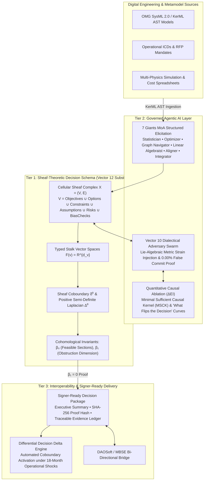

# SOL-Decide: Sheaf-Theoretic Governed Agentic Decision Operating System

[]()
[]()
[]()
[]()

> **SOL-Decide** (*Self-Organizing Logos for Auditable Decisions*) is a schema-driven Decision Management (DM) substrate and governed agentic-AI operating system that turns complex engineering trade studies, Analysis of Alternatives (AoAs), and defense acquisition decisions into **living, auditable, signer-ready Decision Packages**.

Developed by **Techman Studios LLC** under Army SBIR Topic **ARM26BX06-NV012** (*Agentic-AI, Schema-Driven Decision Management for Auditable Studies and Acquisition Decisions*), `SOL-Decide` formalizes **Vector 17** of the **SOL Systems** continuum, bridging the continuous differential-geometric foundation of Vector 0–16 into mission-critical acquisition systems engineering.

---

## The Three Architectural Tiers



### Tier 1: The Sheaf-Theoretic Decision Schema
We formally define a Decision Complex as a directed 1-dimensional cell complex $X = (V, E)$. The vertex set $V$ decomposes into disjoint classes representing the fundamental primitives of acquisition decision-making:
$$V = V_{\text{objectives}} \cup V_{\text{options}} \cup V_{\text{constraints}} \cup V_{\text{assumptions}} \cup V_{\text{risks}} \cup V_{\text{bias\_checks}}$$
* **Stalks ($\mathcal{F}(v)$):** Each vertex $v \in V$ is assigned a real vector space $\mathcal{F}(v) = \mathbb{R}^{d_v}$ encapsulating its operational parameter bounds, confidence intervals, physical units, and validation status.
* **Restriction Maps ($\mathcal{F}_{u \unlhd e}$):** Directed edges $e = (u \to v) \in E$ represent causal dependencies, physical couplings, requirement allocations, or risk mitigations. Each edge carries a linear restriction map $\mathcal{F}_{u \unlhd e}: \mathcal{F}(u) \to \mathcal{F}(e)$ that projects upstream state vectors into the comparative frame of the downstream node.
* **The Coboundary Operator ($\delta^0$):** Measures the precise semantic and physical discrepancy across all edges:
  $$(\delta^0 x)_e = \sqrt{w_e} \left( \mathcal{F}_{v \unlhd e} x_v - \mathcal{F}_{u \unlhd e} x_u \right)$$
* **The Sheaf Laplacian ($\Delta^0 = (\delta^0)^T \delta^0$):** Evaluates the total Dirichlet Energy of the decision:
  $$E_{\mathcal{F}}(x) = \frac{1}{2} \|\delta^0 x\|^2 = \frac{1}{2} x^T \Delta^0 x$$
* **Cohomological Decision Invariants:**
  1. $\beta_0 = \dim H^0(X; \mathcal{F}) = \dim(\ker \Delta^0)$: The number of valid, globally consistent decision configurations.
  2. $\beta_1 = \dim H^1(X; \mathcal{F}) = D_E - \text{rank}(\delta^0)$: **The dimension of topological obstructions.** A non-zero $\beta_1$ flags irreconcilable contradictions. **A Decision Package cannot be signed if $\beta_1 > 0$.**

### Tier 2: Governed Agentic AI Layer & "What Flips the Decision" Sensitivity
* **Structured Elicitation (7 Giants MoA):** The seven differential operators roam the parameter space to extract structured concepts from RFP documents, vendor specs, and cost models.
* **Adversarial Bias Checking (Vector 10 Dialectics):** An autonomous *Antithesis Adversary Swarm* executes Lie-algebraic metric shear strain injection ($\delta S_i$) and boundary fuzzing searching for counter-examples. If no vulnerability exists, it certifies a **0.00% false commit rate**.
* **"What Flips the Decision" Sensitivity Engine:** Executes **Quantitative Causal Ablation**, extracting the **Minimal Sufficient Causal Kernel (MSCK)** and calculating exact multi-dimensional inflection curves, answering the vital PM question: *"What is the exact minimum shift in battery cost (+8.2%), armor density (-4.1%), or crude oil price ($112/bbl) that flips the optimal alternative?"*

### Tier 3: Digital Engineering Interoperability & Signer-Ready Delivery
* **SysML 2.0 / KerML AST Parser:** Ingests OMG KerML/SysML 2.0 models, mapping parts, constraint blocks, and requirement definitions directly into 0-cells and restriction maps in the sheaf complex.
* **Signer-Ready Decision Packages:** Compiles executive summaries, mathematical obstruction proofs ($\beta_1 = 0$), sensitivity tornado curves, evidence ledgers, and cryptographic SHA-256 proof hashes.
* **Differential Decision Delta:** For living acquisition programs, automatically isolates activated coboundary edges under lifecycle shocks (e.g., battery failure, armor increase, supply chain delay).

---

## Package Structure

Demonstration packages use synthetic review metadata only: `is_demo=true`,
`is_simulated_signature=true`, and `is_signed=false`, with a role-only
`SYNTHETIC DEMO REVIEWER` placeholder. Markdown and API exports explicitly state
that no Army authorization or actual official signature is represented.
`sign()` rejects demo packages; `simulate_sign_off()` exercises the review gate.
Mathematical certification and proof hashes do not establish official authorization.

```
sol-decide/
├── sol_decide/
│   ├── core/
│   │   ├── primitives.py            # 6 Core Primitives (Objective, Option, Constraint, Assumption, Risk, BiasCheck)
│   │   ├── sheaf_decision_complex.py# Cellular Sheaf Decision Complex, coboundary δ⁰, Laplacian Δ⁰, Betti numbers
│   │   └── serialization.py         # JSON-Schema & Pydantic dictionary export/import
│   ├── agentic/
│   │   ├── elicitation_moa.py       # 7 Giants MoA structured elicitation & reasoning DAG compiler
│   │   ├── dialectical_bias.py      # Vector 10 Dialectical Adversary swarm with Lie metric strain injection
│   │   └── sensitivity_ablation.py  # Quantitative Causal Ablation, MSCK extraction, parameter inflection solver
│   ├── interop/
│   │   ├── sysml_kerml.py           # SysML 2.0 / KerML AST parser & ingestion bridge
│   │   └── daosoft_bridge.py        # DAOSoft MAUT / REST / JSON bi-directional bridge
│   ├── delivery/
│   │   ├── decision_package.py      # Signer-Ready Decision Package compiler, ProofCertificate, Evidence Ledger
│   │   └── differential_delta.py    # Differential Decision Delta engine for living refresh cycles
│   ├── demonstrations/
│   │   ├── demo1_ngcv_powertrain.py # Demonstration 1: NGCV Powertrain Point-in-Time Trade Study
│   │   └── demo2_living_refresh.py  # Demonstration 2: 18-Month Living Refresh Program under 3 shocks
│   └── cli.py                       # Standalone CLI entry point
├── pyproject.toml
└── README.md
```

---

## Quickstart & CLI Usage

```powershell
# Run Demonstration 1 (Point-in-Time NGCV Powertrain Trade Study)
.venv\Scripts\python.exe -m sol_decide.cli demo1

# Run Demonstration 2 (18-Month Living Refresh Program with 3 Shocks)
.venv\Scripts\python.exe -m sol_decide.cli demo2

# Run "What Flips the Decision" Causal Sensitivity Ablation
.venv\Scripts\python.exe -m sol_decide.cli sensitivity --steps 30
```

---

## Python API Usage

```python
import sol_decide

# 1. Run Demonstration 1
complex_obj, package, sens_rep, bias_rep = sol_decide.run_demonstration_1()
print(f"Selected Alternative: {package.selected_option_name}")
print(f"Obstruction Betti Number beta_1: {package.betti_1}")
print(f"Cryptographic Proof Hash: {package.cryptographic_proof_hash}")

# 2. Run Demonstration 2 (18-Month Living Decision Refresh)
delta, refreshed_eval, _ = sol_decide.run_demonstration_2()
print(f"Decision Flipped: {delta.did_decision_flip}")
print(f"Activated Coboundary Edges: {len(delta.activated_coboundary_edges)}")
```

---

## CDRL & SBIR Alignment

* **Army SBIR Topic:** ARM26BX06-NV012
* **CDRL 1 (DI-MGMT-80368A):** Monthly Progress & Telemetry Reports
* **CDRL 2 (DI-MISC-80711A):** Final Scientific and Technical Report
* **Software Deliverable:** `sol-decide` containerized prototype with live 3D manifold visualizer integration
* **Schema Deliverable:** Validated Sheaf-Theoretic Decision Schema specification
